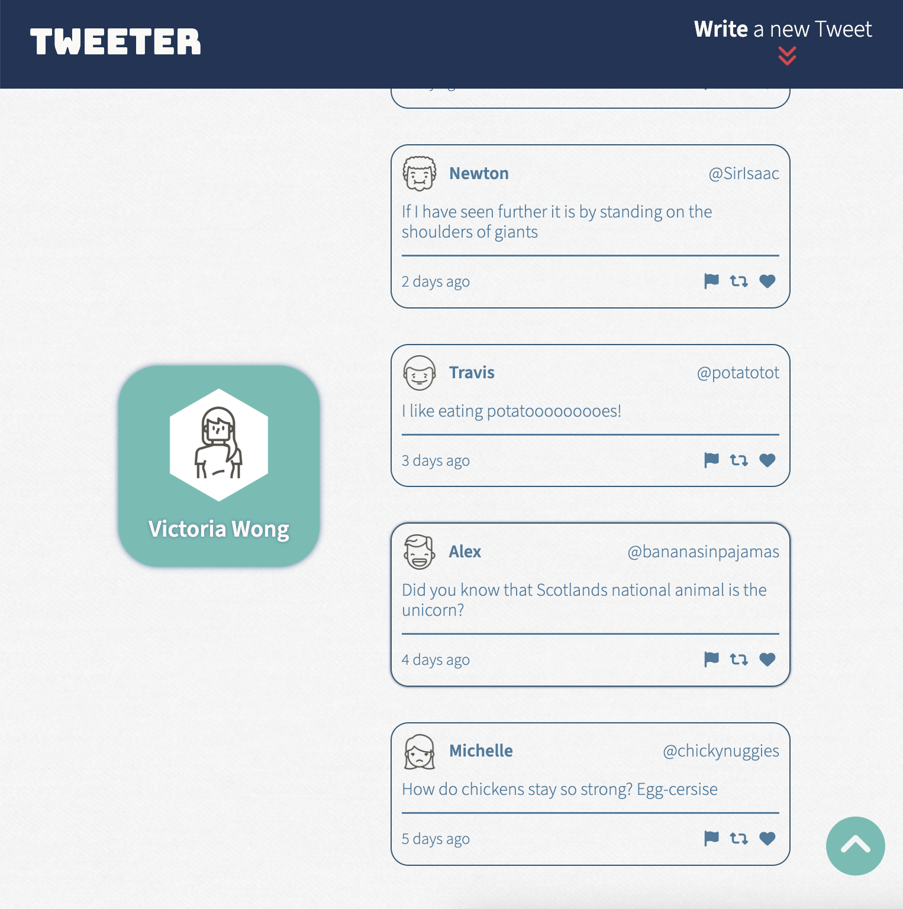

# Tweeter Project

Tweeter is a simple, single-page Twitter clone web app using HTML, CSS, JS, jQuery, AJAX, Node, and Express.

This project  is built using the [Tweeter Template](https://github.com/lighthouse-labs/tweeter) by [lighthouse-labs](https://github.com/lighthouse-labs)

## Table of Contents
- [Getting Started](#getting-started)
- [Dependencies](#dependencies)
- [Project Features](#project-features)

## Getting Started

1. [Create](https://docs.github.com/en/repositories/creating-and-managing-repositories/creating-a-repository-from-a-template) a new repository using this repository as a template.
2. Clone your repository onto your local device.
3. Install dependencies using the `npm install` command.
3. Start the web server using the `npm run local` command. The app will be served at <http://localhost:8080/>.
4. Go to <http://localhost:8080/> in your browser.

## Dependencies

- [Express](https://expressjs.com/)
- [Node.js](https://nodejs.org/en/)
- [body-parser](https://expressjs.com/en/resources/middleware/body-parser.html)
- [chance](https://chancejs.com/)
- [md5](https://github.com/pvorb/node-md5)
- [nodemon](https://nodemon.io/)

## Project Features

**1. Sumbit a new tweet form**

Users can click on the "Write a new tweet" toggle button to show or hide the new tweet form. Once they submit a new tweet, the tweet will display on the top of the feed.

"Write a new tweet button":
- If the new tweet form is hidden, then clicking the button will show the form with the textarea in focus.
- If the new tweet is showing, then clicking the button will hide it. 

**2. Go To Top of Page Button**

- When a user starts scrolling, a "Go To Top of Page" button will appear in the bottom-right corner of the page. Clicking this button, will bring users back to the top of the page. 
- The button will only be visible once the user starts scrolling. Otherwise, it is hidden on the page.

**3. Responsive Design**

The web page has different layouts to accomodate different screen sizes.

**4. Error Display**

- When a user submits an empty tweet, an error message will appear.
- When a user submits a tweet that exceeds 140 characters, an error will appear.
- Error messages will automatically disappear after 1.5 seconds. 
